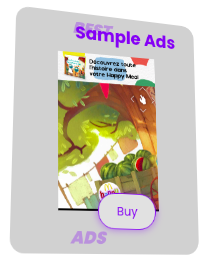
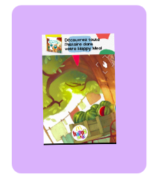

# Creative Recommendation Engine




-- to run locally --

in app/
python app.py /PORTNUMBER
e.g. 
```
$ git clone https://github.com/saminegash/adludio-ds-challenge
$ cd /adludio-ds-challenge
$ pip install -r requerments.txt
$ python app.py --means run on port 80
$ python app.py 8080 -- means run on port 8080(choose yours)
```

=== Introduction ===
Dear candidate. 

Good luck with this challenge, which is a real task that we really need help with right now. There are 4 tasks below.


==background ===
The website:
http://creative-recommend-engine.adludio.com/demo1 

Needs a new graphical user interface.

Please make a new webpage using HTML and JavaScript, or however you see best. You have complete freedom to choose.

=== Task list===

1) Task 1:
What we would like is for the current HTML form to be generalised so that is is populated dynamically with javascript by a call to http://creative-recommend-engine.adludio.com/list_searchable_parameters

This call returns a set of "inputs" as keys and values. for example, for the key "region"
     {"region": ["Africa", "Americas", "Asia", "Europe", "Oceania", "Uncategorized"]}

It would be good to have either a set of check boxes, or a select box, such that one or more of these regions can be selected. 

If you are running a webpage locally, you can either 

1.a) make changes to the 
templates/demo_page.html

There are further instructions on line 257.

Alternatively to 1.a) you may:
1.b) You can right your own page, which calls this endpoint, and then has a submit button or function, which sends the form data to the API endpoint
http://creative-recommend-engine.adludio.com/recommend_sort_games


2) Task 2.
Please draw a code diagram for an incoming call to the app.py file, and the /recommend_sort_games  API endpoint.

3) Task 3.
Please add 3 unit tests to the the file in test/test_set1.py which call some of the functions that you identified in Task 2.

Please add comments to the code that you found difficult to understand, so that others will be able to understand it in the future. 
Bonus points, add doc-strings to 3 of the functions/methods.

4) Task 4.
This task is explorative. There is no right/wrong answer, just different approaches. We want to know what you were thinking while trying to complete this task, and what things did you try, and what things worked well, or did not work well. You will not be graded on the results, but rather on the methods you adopted.

 We now want to know which fields correlated with the click through rates, which is defined as 
    click_through_rates = click-through-event/first_dropped

Please download the raw data from:
http://creative-recommend-engine.adludio.com/get_data_dump

and try to identify correlations between any two of ["vertical", "season", and "region"] and the derived quantity "click_through_rates"

== End remarks ==
Please submit your results, codes (including jupyter notebooks), by the defined date, good luck, and have fun!


